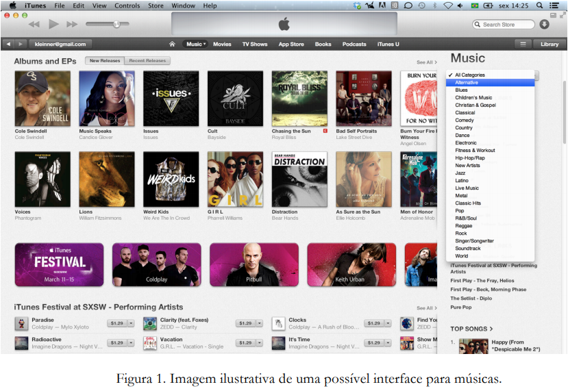
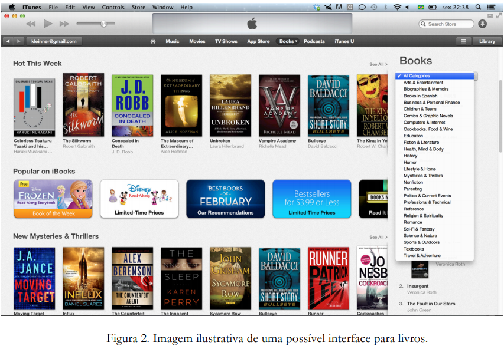
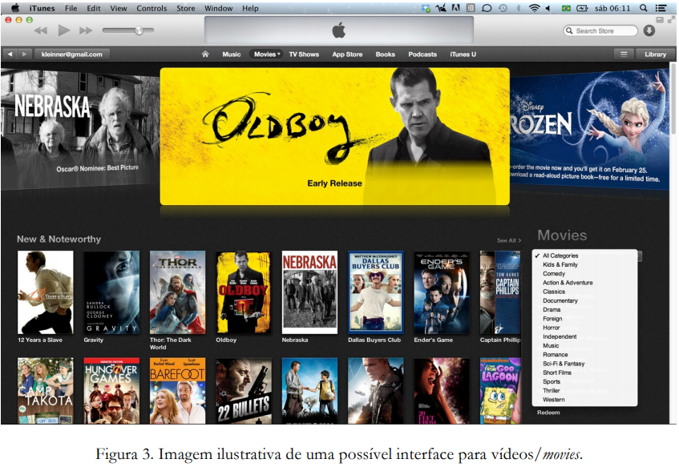
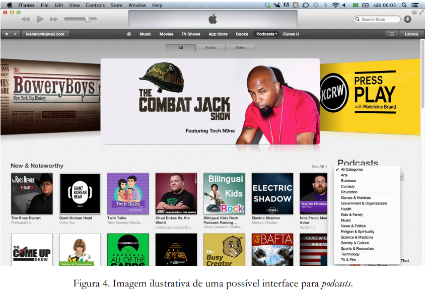

# :computer: Desenvolvimento de Software I 

Este repositório tem como objetivo o desenvolvimento das etapas I e II do trabalho da cadeira de Desenvolvimento de Software I 2020/2.

## Etapa 1 - Entrega: 05/10/2020

- [x] Diagrama de casos de uso (2 pontos) → [@André Hoffmann](https://github.com/Andresho)
- [x] Especificação de casos de uso (2 pontos) → [@André Hoffmann](https://github.com/Andresho)
   - [x] mínimo 7 especificações detalhadas/completas
   - [x] 5 informais; 
- [x] Diagrama de atividades (2 pontos) (no mínimo 5 diagramas) → [@João Vitor](https://github.com/joaovitorps)
- [x] Diagrama de classes (modelo conceitual) (2 pontos) → [@Ariel Azzi](https://github.com/arielazzi)
- [x] Estimativa de esforço de desenvolvimento (2 pontos) → [@Ariel Azzi](https://github.com/arielazzi)

## Etapa 2 - Entrega: 23/11/2020 

- [ ] Diagrama de classes (refinado) (3 pontos)
- [ ] Diagrama de componentes (3 pontos)
- [ ] Demais artefatos do T1 ajustados (4 pontos)

## Descrição Geral 

    
 O propósito do Sistema de Gerenciamento de Mídia, chamado de uniTunes, é permitir que a comunidade acadêmica universitária possa gerenciar mídias utilizando o sistema. O uniTunes possui três stakeholders: acadêmico e administrador. O acadêmico trata-se de todos os stakeholders que tem um vínculo com uma universidade (tais como alunos, professores, técnicos administrativos e dentre outros).
 O acadêmico pode ser um autor, o qual é um usuário que cria algum tipo de mídia e a disponibiliza no uniTunes. Para um acadêmico passar a ser considerado autor, ele deve necessariamente ter criado e disponibilizado uma (ou mais) mídia no sistema. O autor tem o total controle sobre a mídia criada, podendo visualizá-la, removê-la e atualizá-la. A mídia disponibilizada na uniTunes poderá ser de livre acesso ou paga. Cada mídia disponibilizada (de não livre acesso) terá um valor igual ou maior que R$ 0,01. O administrador do sistema é responsável por fiscalizar as atividades realizadas pelos usuários do sistema com o objetivo de evitar comportamentos inadequados como, por exemplo, mídia que viole a privacidade, as regras da universidade, ou mesmo princípios éticos. Se o administrador do sistema identificar alguma mídia inapropriada, ele poderá removê-la, sendo o autor notificado do motivo da remoção da mídia. O administrador poderá também excluir a conta de acadêmicos e autores, porém o inverso não é possível.
   
   A uniTunes terá às seguintes mídias: música (Figura 1), livro (Figura 2), vídeos (Figura 3) e podcasts (Figura 4). Toda mídia é caracterizada pelo seu nome, descrição, imagem, preço, nome do(s) autor(es), conteúdo (sendo a própria mídia), data de criação e categoria. As categorias das mídias são apresentadas no lado direito das Figura 1, Figura 2, Figura 3 e Figura 4. Além destas características, as mídias do tipo música, vídeo e podcasts serão caracterizadas pela duração contabilizada em minutos. Livro, por sua vez, será também caracterizado pelo seu número de páginas. Os stakeholders usarão estas categorias para classificar as mídias e executar buscas mais refinadas e customizadas. O sistema deverá ter uma interface específica para cada tipo de mídia. As Figura 1, Figura 2, Figura 3 e Figura 4 ilustram tais interfaces. Os stakeholders do uniTunes poderão executar uma mídia (exceto para livro), visualizar, comprar, vender, fazer download e organizar mídias digitais em listas de favoritos. Isto é, os stakeholders poderão criar uma lista de favoritos para cada tipo de mídia, bem como visualizar, atualizar e remover uma mídia de uma lista de favoritos.
   
   Todo stakeholder poderá adicionar créditos (R$) à sua conta com o objetivo de comprar alguma mídia, podendo ser via cartão de crédito, transferência ou boleto bancário. Comprar uma mídia significa transferir 90% do valor da mídia da conta do stakeholder (o comprador) para a conta do autor da mídia (o vendedor), os outros 10% do valor serão transferidos para a conta do administrador do sistema, o qual é o representante legal da empresa proprietária do uniTunes. Um comprovante de pagamento será emitido, contendo a descrição do que foi comprado, o valor total vendido, a data, o nome do comprador e do vendedor. O administrador do sistema poderá acompanhar as vendas realizadas no uniTunes através de um dashboard. Ele poderá consultar o nome das mídias vendidas por dia/bimestre/ano, ou mesmo entre duas datas definidas pelo administrador, bem como o valor total vendido no período consultado. As mídias compradas por um stakeholder serão disponibilizadas na lista de mídias adquiridas pelo mesmo. O stakeholder poderá visualizar, a qualquer momento, os seus créditos. O administrador poderá verificar a quantidade e o valor total de mídias vendidas até a data corrente. Os stakeholders poderão fazer downloads das mídias compradas e das mídias de acesso livre. 
   
   Apenas stakeholders autenticados poderão ter acesso ao uniTunes. Sendo assim, a uniTunes deverá apresentar as seguintes funcionalidades: (1) criar conta de usuário. Para isso, o novo usuário deverá fornecer os seguintes dados: primeiro nome, último nome, e-mail (será o login), senha, confirmação de senha; (2) recuperar senha cadastrada, a qual será enviada para o e-mail do usuário; (3) autenticar (fazer login/logout) no sistema. Acadêmicos não poderão ter acesso às funcionalidades inerentes aos autores, nem àquelas inerentes aos administradores. Autores não poderão também ter acesso às funcionalidades inerente ao administrador do sistema. O sistema deve ser capaz de checar se e-mail de cadastro é válido, garantir que a senha tem no mínimo 6 e no máximo 30 caracteres alfanuméricos, garantir que os campos da senha e da confirmação de senha sejam iguais, garantir que o primeiro e último nome não são nulos. Os autores poderão criar álbuns para melhor organizar as suas músicas. Um álbum terá ao menos uma música. Os acadêmicos poderão visualizar os álbuns novos, os álbuns mais recentes e todos os álbuns cadastrados no sistema (vide Figura 1). Álbuns novos são aqueles cadastrados nos últimos sessenta dias, tomando como referência a data que o autor disponibilizou o mesmo para acesso e a data corrente. Por exemplo, se um autor cadastra um álbum em 01/03/1990 e um usuário acessa o uniTunes em 10/04/1990, o álbum será classificado como um álbum novo (vide Figura 1). Se o acesso ocorre em 05/05/1990, o álbum será classificado como recente (vide Figura 1). O uniTunes poderá ser web, desktop ou um aplicativo para dispositivos móveis.

## Contributors ✨

<table>
  <tr>
    <td align="center"><a href="https://kentcdodds.com"> <b>Ariel Azzi</b></a></td>
     <td align="center"><a href="https://kentcdodds.com"> <b>Andresho</b></a></td>
     <td align="center"><a href="https://kentcdodds.com"> <b>joaovitorps</b></a></td>
  </tr>
</table>
